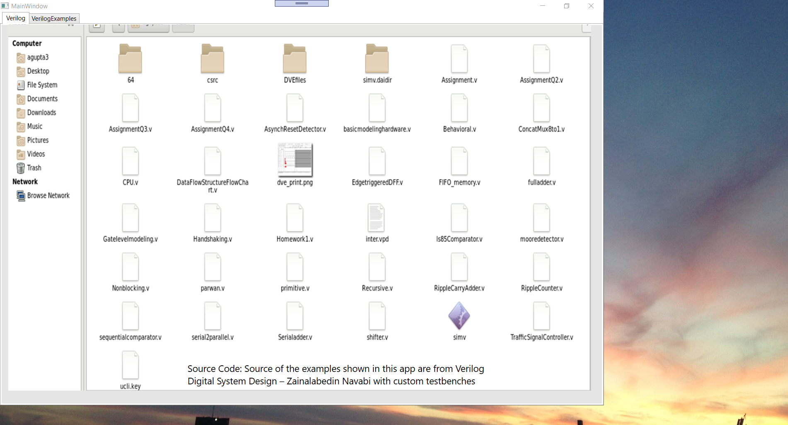
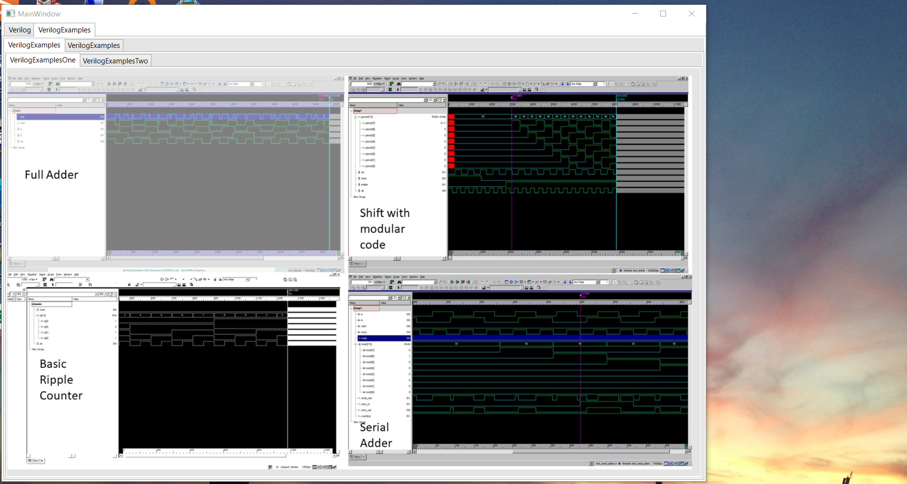
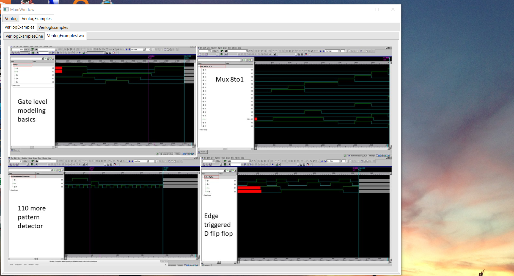
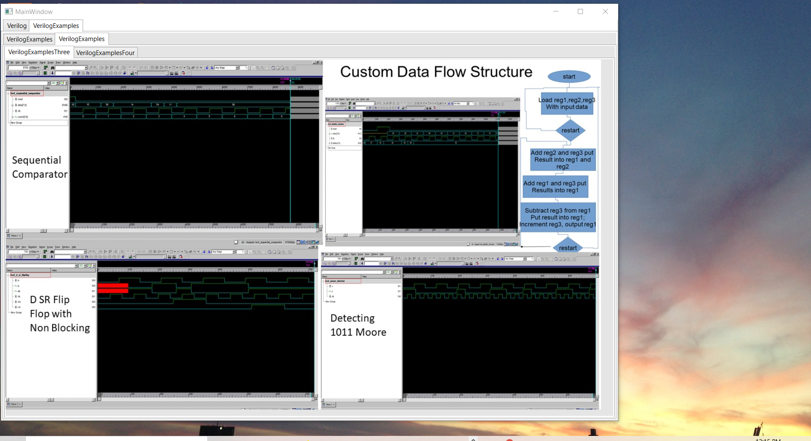
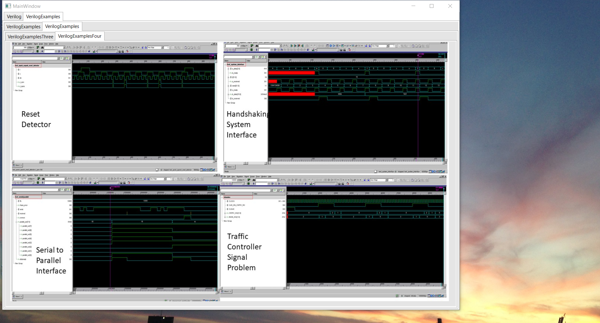
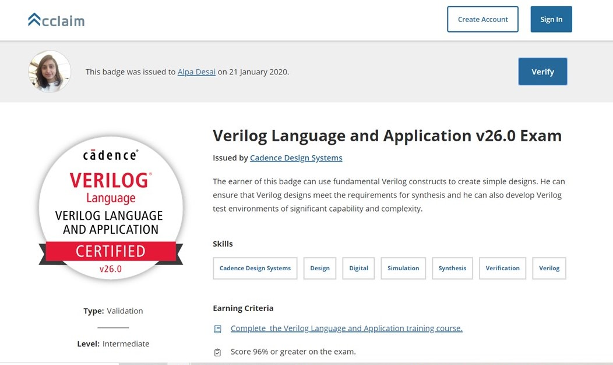

# Verilog HDL

The project provides an overview of Verilg HDL

Confidential information is not displayed.

All images are either custom by Alpa D Desai or a reference name is included.

Additional details reference https://github.com/alpaddesai/VerilogHDL/releases

## Verilog

## Verilog Examples

## Verilog Examples

## Verilog Examples

## Verilog Examples 

## Verilog Applications

## Interest

Additional details reference: https://github.com/alpaddesai/SystemLevelDesignProductPortfolioIdea , https://github.com/alpaddesai/PowerandInfluentialSkills , https://github.com/alpaddesai/ComputerArchitecture and https://github.com/alpaddesai/Custom_ChipDesign_ASICs_Firmware_SoC
